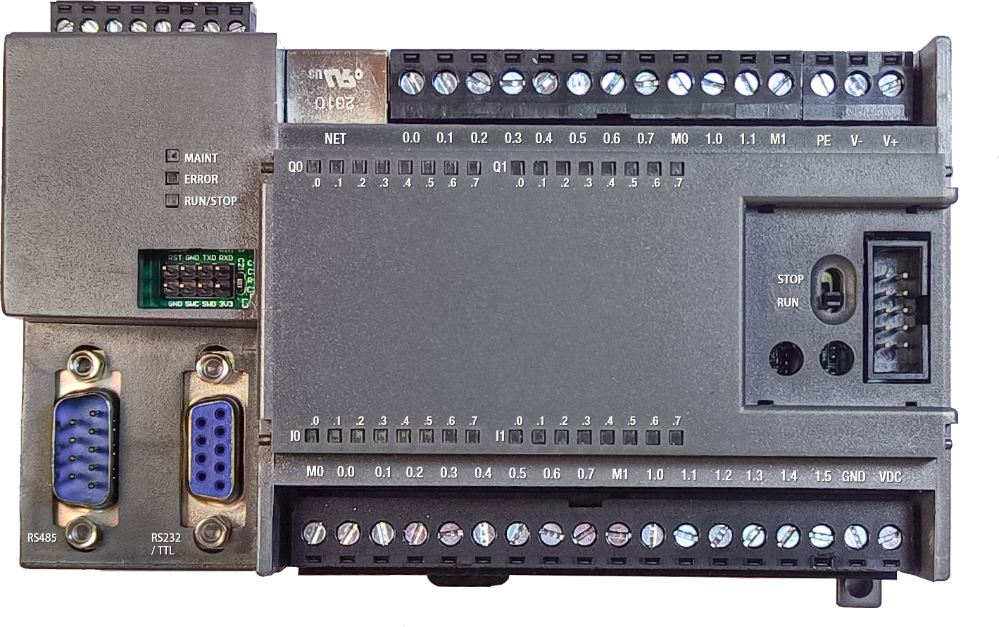
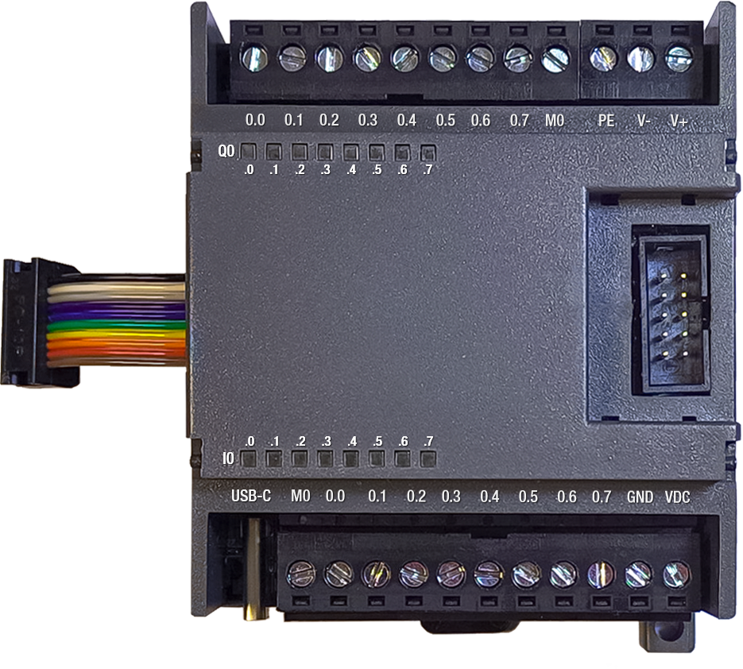
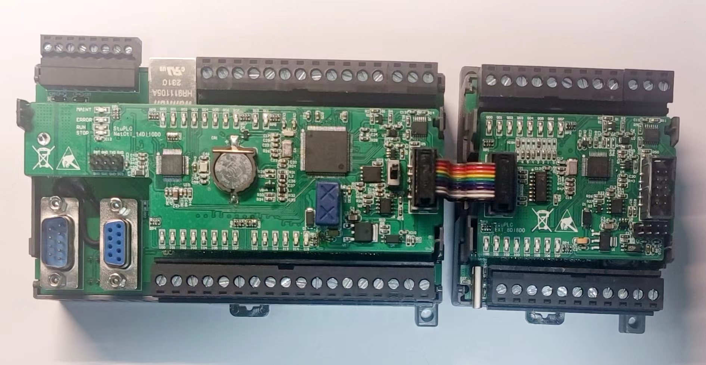

# stuNetCtl

#### 介绍

​        stuNetCtl是一款基于PikaPython的开源的软PLC和可编程运动控制器，我们旨在设计一款软件开源的面向中低端工业控制系统的软PLC产品（也可以称之为解释性PLC），力求以较低的成本实现工业控制系统中的DI，DO，AI，AO，电机伺服系统控制等相关功能。在低成本的同时必须满足基本的实际工业应用需求，电路设计满足一定的工业抗干扰能力，软件系统必须满足足够的开放性和可扩展性。

​        在设计之初，我们并没有把StuNetCtl定义为一款独立工业产品，我们希望它可能包括多种形式的工业控制器主机系统，各类的基本扩展模块，嵌入式软件系统，PC端编程软件和仿真系统（初步定义有基于windows的编程和编译插件，可以运行在windows和linux系统之上的PLC Simulator仿真套件，支持vscode的编程编译和下载插件），

​        上图为设计的NetCtl_14DI10DO的主控和EXT_8DI8DO的IO扩展模块，以及内部电路板连接的示意图。后续如果有精力，我们会逐步设计更多的不同功能的主控和扩展模块。以满足不同的应用需求。

##### 1. stuNetCtl的特点：

1. 一款软件开源的面向中低端工业控制系统的软PLC产品，能以较低成本满足中低端的工业控制系统的基本功能
2. 能够尽可能的兼容国内的HMI生态，除开能够使用市面上的组态屏，能尽可能的兼容和使用国产的串口屏，一起嵌入式的UI组件框架一起配合使用（例如：LVGL， LingLongGUI），所以我们设计了RS232/TTL可切换的串型通信接口，RS485接口，以太网接口
3. 能够满足一定的伺服步进控制系统的应用，所以配置高低DI和高速DO接口（也有低速的DIDO接口，DO可选继电器输出）。支持电机的加减速算法驱动伺服步进系统。
4. 以最低成本实现稳定可靠的外部扩展功能，能够实现外设的自动识别/自动挂载，无需软件配置，可以实现像操作本机IO一样操作扩展模块
5. 支持市面工业自动化和工业物联网最常用的modbus和mqtt等协议，支持常用的mbedTLS加密算法，可实现基本的用户代码的加密功能。
6. 支持RTC时钟功能。配合mbedTLS加密算法可以实现设备使用权限管理，配置项目的周期试用，实现时间的权限管理，采用ntp网络授时协议，并不允许用户随意篡改RTC时钟。
7. 采用PikaPython编程，与Python3语法兼容，采用PC端编译为字节码，串口/网口下载的模式，同时支持工程文件加密备份功能，支持从设备端加载工程文件到PC的功能。
8. 提供PC编译和下载的软件，支持采用VsCode编程和编译下载（后续可以提供Vscode插件，这一块目前没有研究透，目前提供的软件为终端调用执行）。
9. 后续考虑推出基于**Windows**和**Linux**的**Simulator**，可以实现无硬件仿真运行编程代码。也可以通过工控机或者linux终端外挂扩展模块，仿真器的真实外设控制功能。

​        **以下是画大饼环节**：后续有精力会持续为其扩展功能，但毕竟是业余时间在维护项目，所以不保证如下功能功能一定实现，如下功能可能会作为单独的工程提供，并不一定会直接集成到基本的功能固件当中。也就是如果实现如下特定的功能，可能会失去部分基本功能（比如以下功能可能短时间无法在**Windows**和**Linux**的**Simulator上**实现）。

10. 整合运动控制器的多轴联动插补功能，并且集成部分机器人构型的正逆解算法。实现例如：XYZA，四轴码垛，SCARA等构型的机器人的正逆解算法，实现笛卡尔坐标系和轴坐标系，以及工件坐标系的相对控制功能。
11. 提供兼容三菱Gx-Works的工程或者固件，实现采用Gx-works的PLC编程工具对设备进行PLC编程。
12. 提供基于IEC611131-3编程语言进行编程，兼容国际通用的PLC编程标准（最近正在研究IEC2Python框架，如果实现，可以通过开源的matiec架构实现IEC2IEC，在通过IEC2Python实现把IEC611131-3标准的编程语言转化为python语法结构，最终通过pikaPython解释执行 ）
13. 提供数控加工的G代码解析功能，实现简易的数控控制系统（比如涂鸦，激光雕刻，简易数控加工）。
14. 发挥想象，创造stuNetCtl的无限可能。

##### 2. NetCtl_14DI10DO主控的硬件设计特点：

1. 主控采用控制核心板，接口电路板，电源板堆叠而成，可以方便的选择DC供电模式/AC供电模式，主控可以选择AT32F435+W5500的网络形式，也可以选择AT32F437+lan8720A运行lwip的网络形式，主频：288Mhz，最高4032KB的Flash，512KB的RAM，外部扩展8MB的SPI NorFlash。同时输出部分可以同时兼容高速MOS输出，低速MOS输出，继电器输出多种输出形式。
2. 核心板和接口电路板均采用4层板设计，设计独立的地层分割设计。提高系统的稳定性和抗干扰性。
3. 核心板除开默认的AT32F435+W5500/AT32F437+lan8720A的方案之外，为了二次开发方便，硬件上兼容STM32F103/F407/F427/H 563/H573等基于STM32的MCU，以及绝大部分兼容STM32的国产控制器（例如AT32F403A/APM32系列）。只需要修改几个电阻电容和主控既可以快速切换其他平台。（目前项目主线维护AT32F435+W5500/AT32F437+lan8720A两大平台），后期会同时提供STM32F103+W5500/STM32F407+lan8720A的硬件接口驱动代码，以方便用户自己用来开发自己的应用程序。
4. 通信接口包括：RS232/TTL、RS485、ETH接口。考虑到项目的应用成本，设计了可以通过拨码开关选择的RS232/TTL切换通信接口电路，以满足目前国内的低成本串口屏，或者自主设计的基于LVGL等UI框架的屏幕开发板作为该PLC的HMI界面。当然也可以使用工业上常用的RS485，或者以太网接口的组态屏作为HMI交互界面。RS485和以太网同时也可以外接各类的外设和扩展设备。
5. 内置法拉电容超级电容器和电源输入检测电路，检测外部电源断开会中止程序运行，保存数据，以防重要数据丢失。
6. 自带10Pin的自主设计的支持自动识别的外设扩展接口，基于modbus通信扩展，理论支持最高可以扩展上百路的扩展模块（目前只做了一款8DI/8DO的扩展板，目前测试10几个扩展板相当于上百路DI上百路DO通信稳定），且DI/DO/AI/AO等扩展模块会自动映射的PLC的IO接口和寄存器上，无需任何配置，直接像使用主机的IO一样使用扩展外设。另外可以根据开源的电路，自行设计自定义的各种扩展模块。
7. 扩展模块支持自动识别，无需配置添加，上电会自动识别扩展模块的类型和对应的接口，自动映射到对应的IO和外设上（比如主机占用Q0和Q1两组输出，第一个DO的扩展模块会自动映射到Q2组以及后续的的输出上）。
8. DIDO采用全隔离设计，高速DO模块支持200K以上的脉冲输出，高速输入支持计数输入和AB项计数。
9. AIAO输出，AI输入检测支持0-10V（0~20ma）检测，两种可选。AO输出默认为0-20ma输出，可以通过焊接或者外置采样电阻实现0-10V输出。
10. 默认为4路高速输入，8路高速输出，8路高速输出可以配置为4路AB项输入功能。硬件上默认可以支持8路高速输出（因为主机默认10个DO，默认配4路高速比较合理，伺服电机还需要方向和使能引脚。更多的输出意义不大）。
11. 默认配置4路AI输入和2路AO输出。

##### 3. EXT_8DI8DO扩展模块的特点：

1. DIDO驱动全隔离，可选择MOS管DO驱动和继电器驱动
1. 核心板和接口电路板均采用4层板设计，设计独立的地层分割设计。提高系统的稳定性和抗干扰性。
1. 内置type-C的USB通信接口，可以通过接口实现配置，固件升级等功能。
1. 可以独立使用，可以设置为外设主机模式和外设从机模式，当作为外设主机模式时，无需PLC主机，直接通过USB口连接PC或者Linux系统，实现通过一个USB先控制扩展模块，以及扩展模块连接的后续扩展模块。实现在stuNetCtl的仿真环境中连接真实外设的功能。

#### 软件架构

#### 更新日志

#### 使用教程

1.  xxxx
2.  xxxx
3.  xxxx

#### 感谢以下项目作者

1.  [PikaPython(一个完全重写的超轻量级 python 引擎): https://github.com/pikasTech/PikaPython](https://github.com/pikasTech/PikaPython)
2.  [rt-thread(一款以开源的物联网操作系统): https://github.com/RT-Thread/rt-thread](https://github.com/RT-Thread/rt-thread)
3.  [agile_modbus(一款开源的支持跨平台的轻量型 modbus 协议栈): https://github.com/loogg/agile_modbus](https://github.com/loogg/agile_modbus)
4.  [mqttclient(一个高性能、高稳定性的跨平台MQTT客户端): https://github.com/jiejieTop/mqttclient](https://github.com/jiejieTop/mqttclient)
5.  [mbedtls(一个实现加密、X.509证书操作以及SSL/TLS和DTLS协议的C库): https://github.com/Mbed-TLS/mbedtls](https://github.com/Mbed-TLS/mbedtls)
6.  [beremiz(一个开源的符合IEC61131-3标准的PLC集成开发环境): https://github.com/beremiz/beremiz](https://github.com/beremiz/beremiz)
7.  [matiec(一个开源的基于IEC 61131-3标准的PLC编译器，beremiz所使用的编译器内核): https://github.com/beremiz/matiec](https://github.com/beremiz/matiec)
8.  [Modbus(一款开源的Modbus库，beremiz所使用的modbus协议库): https://github.com/beremiz/Modbus](https://github.com/beremiz/Modbus)
9.  [modbus_rt(一款纯C实现的跨平台modbus协议通信库): https://github.com/SenySunny/modbus_rt.git](https://github.com/SenySunny/modbus_rt.git)

